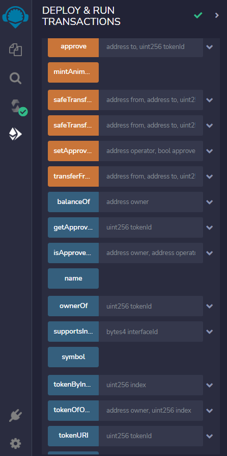

# 1주차 과제__진주현

## #프로젝트 기획

### 1. 기획 배경

 최근 MZ세대에서 유행하는 갓생살기의 한 가지로 미라클 모닝이 유행입니다. 실제 싸피에서도 운영되고 있는 만큼 많은 사람들이 자신의 삶을 위해, 성공을 위해 미라클 모닝을 실행하고 있습니다. 미라클 모닝의 동기부여가 되도록 nft를 활용하고 싶었습니다.

 우리나라에서 성공의 기준이라 함은 여러가지가 있지만 그 중에서도 땅, 아파트 같은 현물을 사는 것이 성공의 기준이라고 여깁니다. 그래서 nft를 이와 같은 방식으로 지급하면 미라클 모닝에 큰 동기부여가 될 것이라고 생각합니다. 

 '일찍 일어나는 자가 땅을 산다'를 프로젝트 주제의 모토로 설정하고 '미라클 버드' 프로젝트를 기획하게 되었습니다.

### 2. 실행 계획

 '일찍 일어나는 자가 땅을 산다'는 슬로건에 맞춰 미라클 모닝을 인증하면 SSF 코인을 획득하여 '미라클 버드' 내에서 구입가능한 싸피 지역의 구역(땅) NFT를 구매할 수 있습니다. 단순히 일찍 일어나는 것만이 아닌 여러 미션등을 통해 추가적으로 SSF 코인을 얻을 수 있습니다. 또한 유저들의 흥미를 위해 미션 인증시 AR 기반 사진 촬영 기능을 추가할 예정입니다.

 

## #블록체인 학습

 프론트를 담당하여 블록체인에 대해 깊게 공부하진 않았지만 프로젝트를 이해하기 위해 블록체인을 학습했습니다.

### 스마트 컨트랙트

